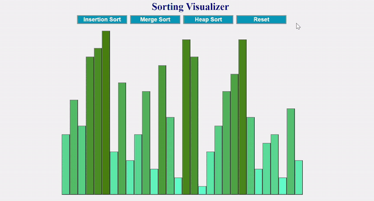
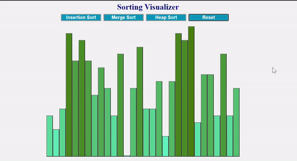
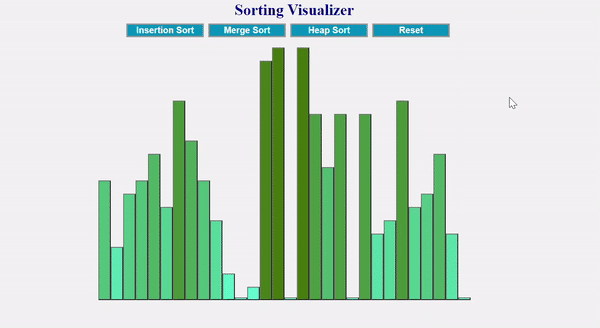
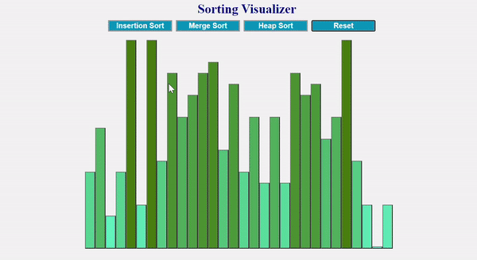

# Sorting Visualizer in REACT:

Welcome to my sorting visualizer in React. Look at the demo below to get an idea of what this project is about.
  
## About this Sorting Visualizer:

This sorting visualizer is unique in that it uses REACT, the visualizer looks like below:

### Insertion Sort

### Merge Sort

### Heap Sort

### Reset Button

You can select between "Insertion Sort", "Merge Sort", and "Heap Sort" to see how each type of sorting works.

This app is deployed on : [TBA]
