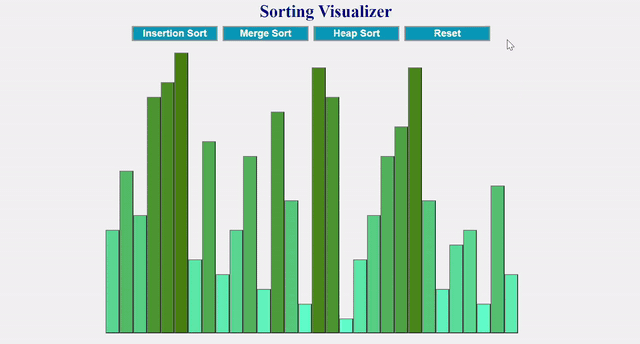

# Sorting Visualizer in REACT:

Welcome to my sorting visualizer in React. Look at the demo below to get an idea of what this project is about.
  
## About this Sorting Visualizer:

This sorting visualizer is unique in that it uses REACT, the visualizer looks like below:

You can select between "Insertion Sort", "Merge Sort", and "Heap Sort" to see how each type of sorting works.

This app is deployed on : [TBA]

## To setup this Sorting Visualizer in your local device:

Since this application is based in REACT, you would need to setup Node.js and REACT on your local environment first and then copy the contents under the src folder of this directory to your local react application.

This can be a good tutorial to start with: https://reactjs.org/docs/create-a-new-react-app.html#create-react-app

STEP 1: 
        Make sure you have Node.js installed in your computer. 
        To install Node.js Go to: https://nodejs.org/en/

STEP 2:
      Use:
          npx create-react-app my-app
                OR
          npm init react-app my-app
      to initialize react-app in your computer.

STEP 3: 
        under <current-location>/my-app/src/:
          * replace the contents there with contents from this repo under: Sorting-Visualizer/src/
